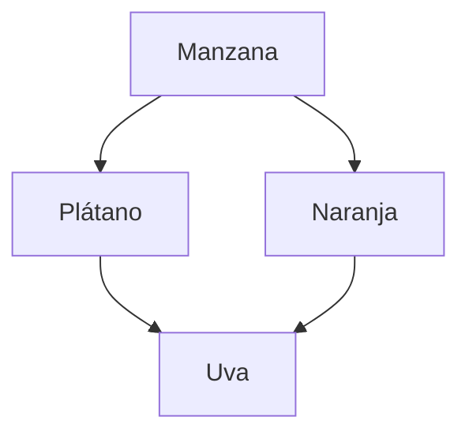

# Frutas1

# Documentación del Proyecto Backend de Frutas

¡Bienvenido al proyecto backend de frutas! 

Esta documentación proporciona una guía detallada sobre cómo utilizar nuestra API para gestionar información relacionada con frutas. 


## Sumario
- [Introducción](#introducción)
- [URL Base]("http://localhost:3008/api/v1/")
- [Métodos HTTP](#métodos-http)
  - [GET - Obtener información sobre frutas](http://localhost:3008/api/v1/frutas)
  - [POST - Agregar una nueva fruta](http://localhost:3008/api/v1/fruits)
  - [PUT - Actualizar información de una fruta](http://localhost:3008/api/v1/fruits)
  - [DELETE - Eliminar una fruta](http://localhost:3008/api/v1/fruits/{id})
- [Configuración de MongoDB](MONGODB_URI=mongodb://localhost:27017/fruits_db)
- [Gráfico de Ejemplo](Aspose.Words.4959fece-9cfe-4f86-8e47-59000c85a229.001.jpeg)


## URL Base

La URL base para acceder a nuestra API es:
http://localhost:3008/api/v1/

## Métodos HTTP

### GET - Obtener información sobre frutas

Para obtener información sobre las frutas disponibles, realiza una solicitud GET a la siguiente ruta:


GET http://localhost:3008/api/v1/fruitas


### Grafico


### Tablas

URL | PETICION | DESCRIPCION
---:|:---:| ---
|[/frutas](http://localhost:3008/api/v1/fruits) | GET  | Obtener todas las frutas


### Codigo
```json
 
{
  "name": "Manzana",
  "price": 1.99,
  "quantity": 100
}

```Javacript
 {
        "id": 2,
        "imagen": "🍎",
        "nombre": "Manzanas",
        "importe": 270,
        "stock": 50
    },
